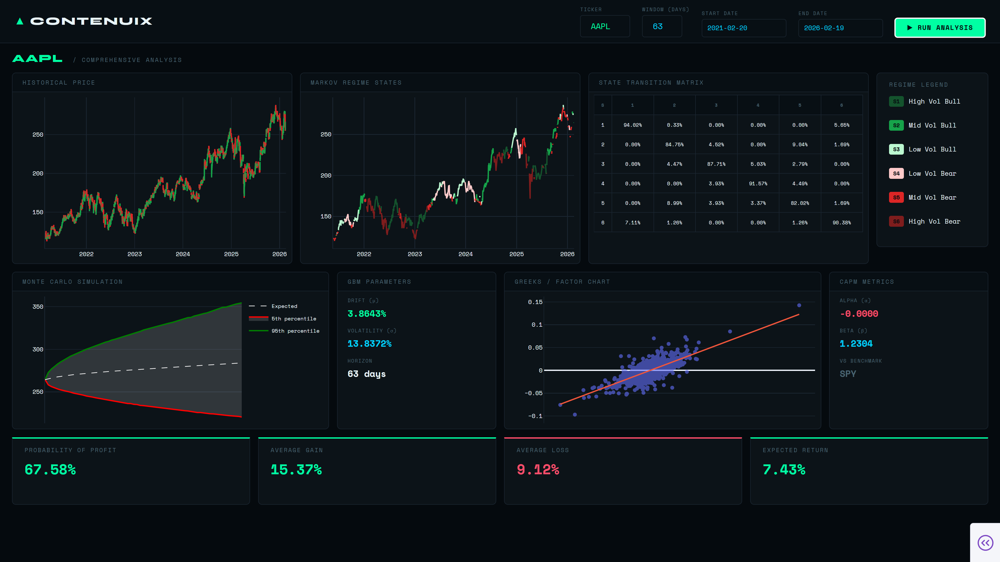

## Example

## 📈 Methodology

This dashboard uses a **Markov-Switching lognormal diffusion model** to simulate forward price paths over a 63-day (quarterly) horizon.

Instead of assuming constant volatility like standard GBM, the model allows volatility to change depending on the current market regime.

---

### 1️⃣ Regime Detection

Daily log returns are computed as:

$$r_t = \ln\left(\frac{S_t}{S_{t-1}}\right)$$

A 63-day rolling variance of returns is calculated, and volatility regimes are assigned using historical percentiles:

- **State 1 (Low Volatility):** Rolling variance below the 30th percentile  
- **State 2 (Moderate Volatility):** Between the 30th and 85th percentiles  
- **State 3 (High Volatility):** Above the 85th percentile  

This creates a data-driven volatility classification rather than manually defining market conditions.

---

### 2️⃣ Markov Transition Matrix

A first-order Markov transition matrix $P$ is estimated from historical state changes:

$$P_{ij} = \mathbb{P}(S_{t+1}=j \mid S_t=i)$$

This matrix determines how likely the system is to remain in the same volatility regime or transition to another one during simulation.

---

### 3️⃣ Regime-Conditional Parameters

For each state $i$, the conditional mean and standard deviation of returns are calculated:

$$\mu_i = \mathbb{E}[r_t \mid S_t = i]$$

$$\sigma_i = \mathrm{Std}(r_t \mid S_t = i)$$

Returns are modeled as:

$$r_t \mid S_t=i \sim \mathcal{N}(\mu_i, \sigma_i^2)$$

So volatility and drift are allowed to vary depending on the active regime.

---

### 4️⃣ Monte Carlo Simulation

For each simulated path:

1. The next regime is sampled using the transition matrix.
2. A random shock $Z \sim \mathcal{N}(0,1)$ is drawn.
3. Price evolves according to a regime-dependent diffusion process:

$$S_{t+1} =
S_t \exp\left(
\mu_i - \frac{\sigma_i^2}{2} + \sigma_i Z
\right)$$

Over 1,000+ simulated paths, this approach captures:

- Volatility clustering  
- Regime persistence  
- State-dependent dispersion  
- Non-constant risk dynamics  

Unlike standard GBM (which assumes constant $\mu$ and $\sigma$), this model allows risk behavior to evolve based on historical regime structure.
